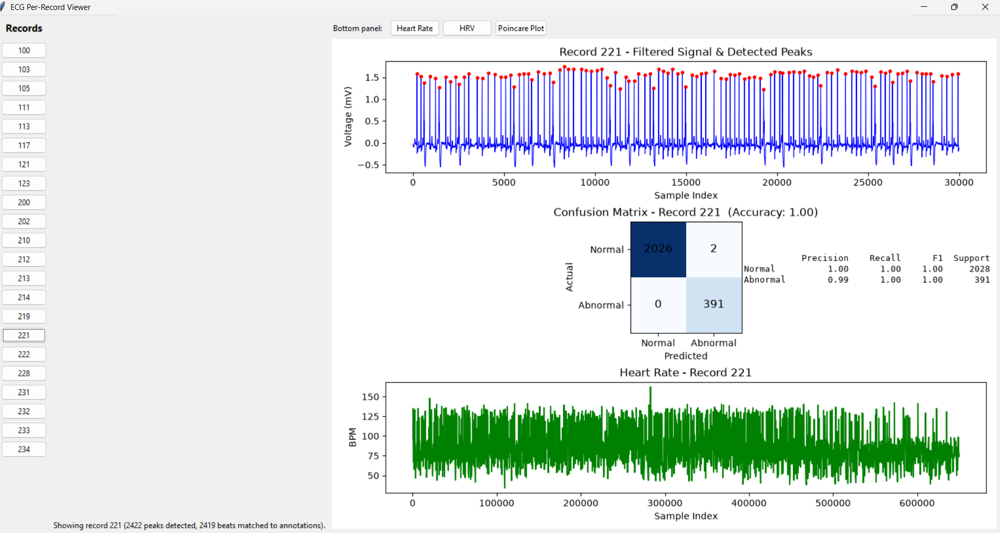
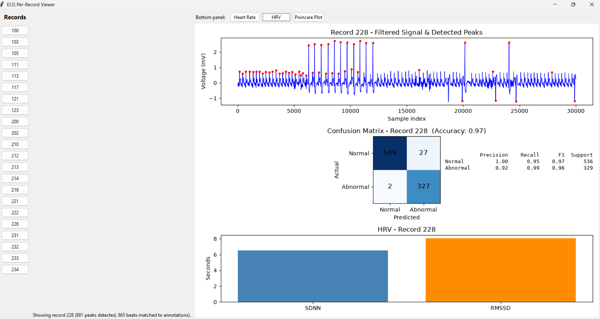

# ECG QRS Detection & Arrhythmia Classification

A from-scratch Python implementation of the **Pan-Tompkins QRS detection algorithm**, applied to the [MIT-BIH Arrhythmia Database](https://physionet.org/content/mitdb/1.0.0/), with a feature-based classifier that flags detected beats as **Normal** or **Abnormal**, and a desktop GUI for inspecting results record-by-record.





## Features

- **Signal cleaning** — Butterworth bandpass filtering + IIR notch filtering (powerline hum removal)
- **QRS detection** — a from-scratch Pan-Tompkins pipeline (bandpass → derivative → squaring → moving-window integration → adaptive thresholding), including:
  - Region-based peak tracking (finds the true maximum of each above-threshold region, not just the first sample that crosses it)
  - A noise-tolerance grace period so brief signal dips don't fracture one beat into two
  - **Search-back recovery** for beats that fall below a temporarily-elevated threshold (e.g. right after an unusually tall preceding beat)
- **Peak refinement** — corrects Pan-Tompkins' approximate peak locations to the true local extremum in the filtered signal
- **Feature extraction** — RR interval (before/after), peak amplitude, and QRS width, matched against ground-truth annotations
- **Beat classification** — a `DecisionTreeClassifier` trained to distinguish Normal vs. Abnormal beats
- **Interactive GUI** — a Tkinter window with one button per record; view that record's filtered signal, confusion matrix (with accuracy/precision/recall/F1), heart rate, HRV, and Poincaré plot

## Why an inter-patient (DS1/DS2) train/test split

This project deliberately does **not** use a random 80/20 split of individual beats. Since heart-rhythm morphology is highly patient-specific, a random beat-level split lets beats from the same patient appear in both the training and test sets — the classifier can partly "recognize the patient" rather than "recognize the arrhythmia," which inflates test performance in a way that won't hold up on a genuinely new patient.

Instead, this project uses an **inter-patient split**: training and test sets are built from entirely different patient records (following the standard DS1/DS2 partition used in ECG arrhythmia research, e.g. de Chazal et al.). No patient's beats appear in both sets.

## Project structure

```
.
├── ecg_pipeline.py       # Core pipeline: filtering, QRS detection, feature
│                         # extraction, dataset building, classifier training
├── ecg_pipeline_gui.py   # Same pipeline + a Tkinter GUI for per-record inspection
└── README.md
```

## Requirements

- Python 3.9+
- [`wfdb`](https://pypi.org/project/wfdb/) — reading PhysioNet/MIT-BIH records and annotations
- `numpy`
- `scipy`
- `scikit-learn`
- `matplotlib`
- `tkinter` (ships with most standard Python installs; on some Linux distros install via your package manager, e.g. `sudo apt install python3-tk`)

Install the Python dependencies with:

```bash
pip install wfdb numpy scipy scikit-learn matplotlib
```

## Data

This project uses records from the **MIT-BIH Arrhythmia Database**. `wfdb.rdrecord('100')` / `wfdb.rdrecord('100', pn_dir='mitdb')` can fetch records directly from PhysioNet, or you can download the database locally and point `wfdb` at the local directory. See the [WFDB Python package docs](https://wfdb.readthedocs.io/) for both options.

The record lists used for training/testing (`TRAIN_RECORDS` / `TEST_RECORDS` in the code) follow the standard DS1/DS2 inter-patient partition.

## Usage

### Command-line pipeline (train + evaluate)

```bash
python ecg_pipeline.py
```

This builds the training and test datasets, trains the classifier, and prints:
- Per-feature importances
- A classification report (precision/recall/F1 for Normal vs. Abnormal)
- The overall confusion matrix

### GUI (per-record inspection)

```bash
python ecg_pipeline_gui.py
```

This trains the classifier once on `TRAIN_RECORDS`, then opens a window with one button per test record. Selecting a record shows:
1. The filtered signal with detected R-peaks (first N samples, for readability)
2. That record's own confusion matrix, with accuracy/precision/recall/F1
3. A switchable bottom panel — **Heart Rate**, **HRV** (SDNN/RMSSD), or **Poincaré Plot** — computed over the record's full beat sequence

## Key implementation notes / lessons learned

A few non-obvious details worth knowing if you're extending this code:

- **Filter band conflicts:** if you pre-filter the signal for display (e.g. a wide 20-80Hz band) and then feed that into `pan_tompkins()`, its internal 5-15Hz bandpass has little useful signal left to work with. Keep any pre-filtering band wide enough (e.g. 0.5-40Hz) to not clip the 5-15Hz QRS band.
- **Annotation filtering matters:** MIT-BIH annotation files include non-beat markers (rhythm changes, signal-quality flags, etc.) alongside real beat labels. Filtering to genuine beat symbols *before* nearest-neighbor matching prevents a detected peak from being incorrectly matched to a non-beat marker.
- **Match tolerance is a real trade-off:** too tight, and legitimate but slightly-offset detections (common with wider, abnormal QRS complexes) get dropped from the dataset; too loose, and detections start matching to the wrong neighboring annotation. The current tolerance (`match_tolerance_sec=0.05`) was tuned by directly inspecting mismatches on known problem beats — see the QRS width feature note below for one of the abnormal-beat cases this uncovered.
- **QRS width is a high-value feature:** RR interval and raw amplitude alone struggle to separate wide/deformed abnormal beats (e.g. PVCs, bundle branch blocks) from normal ones. Measuring QRS duration directly (via the half-amplitude crossing points around each peak) gives the classifier a much more direct signal for these beat types.

## Known limitations

- The classifier collapses several distinct abnormal beat types (`L`, `R`, `A`, `V`, `F`, `/`) into a single binary "Abnormal" label. These types have quite different physiological signatures (e.g. atrial premature beats have a *narrow* QRS, unlike ventricular beats), so a single binary classifier with these features performs noticeably better on some abnormal types than others.
- Only channel 0 of each record is used; multi-channel fusion is not implemented.
- The decision tree is a simple baseline; a random forest or gradient-boosted model would likely improve recall on the harder abnormal beat types.

## License

Add your preferred license here (e.g. MIT).
